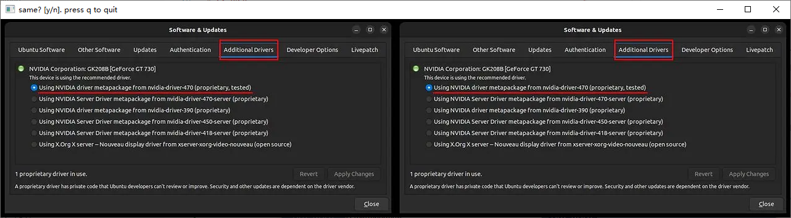

- [1. update log](#1-update-log)
- [2. install](#2-install)
- [3. cli](#3-cli)
- [4. gui](#4-gui)


---
## 1. update log

- 0.0.9 2024/04/11

    - [x] 图片重命名bug：由一次改为循环，直到不重名。
    - [x] 程序退出而复制的图片还要手动删除：延迟复制图片（本地）。
    - [ ] 延迟复制图片（网络）还未实现
    - [x] 图片路径的`..`数量不对
    - [x] markdown_gui 的cli错误
    - [x] setup.py缺少PySimpleGUI依赖
    - [ ] markdown_gui 传入cli参数后，修改文件位置的gui按钮，不能读取当前文件的位置，而是采用默认上一次文件管理器操作的文件位置，这样很麻烦。

## 2. install
```bash
pip install -e .
```

## 3. cli
```python
$ markmove_gui --in_root D:/BaiduNetdiskDownload/5.2023版Java面试教程 --in_article 08-并发编程篇/讲义/多线程相关面试题 copy.md --out_root D:/code_my/learn_java --out_article_dir docs/juc --out_article_name 多线程.md --out_imgsdir images --remote_img_suffix ('.png', '.jpg', '.jpeg', '.gif', '.bmp', '.webp')
```
```
D:\git\nerf-pytorch
├── docs
│   ├── dataset
│   │   ├── 相机和nerf.md
└── images
    ├── 0.png
└── imgs
    ├── 1.png
```
```
D:\git\dd
├── docs
│   ├── a
│   │   ├── aaa.md
└── images
    ├── 0.png
    ├── 1.png
```



如果碰到同样的图片，那么会跳出opencv的提示，“是否一样”，
- `y`：跳过复制 
- `n`：重复的不动并且加上`_new`复制。
- `q`: 则退出

## 4. gui


```bash
$ markmove_gui
 
$ markmove_gui --in_root D:/BaiduNetdiskDownload/5.2023版Java面试教程 --in_article 08-并发编程篇/讲义/多线程相关面试题 copy.md --out_root D:/code_my/learn_java --out_article_dir docs/juc --out_article_name 多线程.md --out_imgsdir images --remote_img_suffix ('.png', '.jpg', '.jpeg', '.gif', '.bmp', '.webp')
```