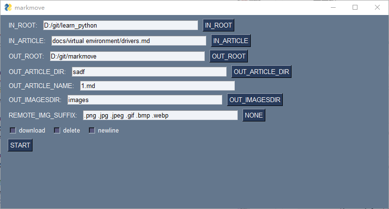

## install
```bash
pip install -e .
```

## cli
```python
markmove --in_root D:\git\nerf-pytorch --in_article docs\dataset\相机和nerf.md --out_root D:\git\dd --out_article docs/a/aaa.md 
```
```
D:\git\nerf-pytorch
├── docs
│   ├── dataset
│   │   ├── 相机和nerf.md
└── images
    ├── 0.png
└── imgs
    ├── 1.png
```
```
D:\git\dd
├── docs
│   ├── a
│   │   ├── aaa.md
└── images
    ├── 0.png
    ├── 1.png
```


如果碰到同样的图片，那么会跳出opencv的提示，“是否一样”，
- `y`：跳过复制 
- `n`：重复的不动并且加上`_new`复制。
- `q`: 则退出

## gui
